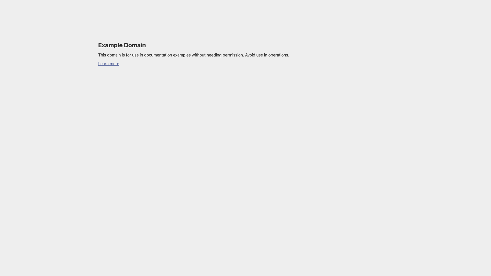

# Verification report — v1 → v2

Project: `examples/docs-reference-project` · **1920×1080 · 10.000s · 30 fps · 300 frames**
CLI: `hyperframes@0.7.90` (project pin bumped from `0.7.88` during this pass and
re-verified — see "Toolchain" below).

---

## 1. Gate results

All commands were run in the project directory. These are the actual results.

| Gate                                            | Result                                                      |
| ----------------------------------------------- | ----------------------------------------------------------- |
| `npx hyperframes lint --verbose`                | **0 errors, 0 warnings** (2 files scanned)                  |
| `npx hyperframes check`                         | **passed** — `ok: true`                                     |
|   › lint                              | 0 errors · 0 warnings · 1 info                              |
|   › runtime                           | 0 errors · 0 warnings · 0 info                              |
|   › layout                            | 0 errors · 0 warnings · 1 info                              |
|   › motion                            | 0 findings (no `*.motion.json` sidecars in this project)    |
|   › contrast                          | 0 errors · 0 warnings · 0 info                              |
| `check --caption-zone "…y0=.83…severity=error"` | **passed** — 0 caption-band collisions across 8 seek points |
| `npx hyperframes snapshot --at …` (19 frames)   | captured + inspected; 3 contact sheets                      |
| `npx hyperframes render`                        | **passed** — H.264 1080p + AAC stereo, exactly 10.000s      |

Final media inspection: 1920×1080 H.264, 30 fps, AAC stereo at 48 kHz,
10.000 seconds. Mean volume is −22.9 dB and the peak is −3.8 dB.

### The two info-level findings, and why they stay

Neither gates the exit code. Both are deliberate.

1. `pointer_events_none` on `compositions/captions.html` → `#root`.
   The caption overlay spans the whole canvas above the artwork, so its root must be
   click-through or nothing underneath is selectable in Studio. The pills themselves
   carry `pointer-events: auto`, so the editable content _is_ selectable — which is
   exactly what the finding's own fix hint asks for. Keeping `pointer-events: none` is
   correct; the alternative is an invisible full-canvas div that eats every click.

2. `container_overflow` on `#title` at `t=0.556`, inside `span.title-mask`.
   This is the mask doing its job: the title starts at `yPercent: 106` and rises into
   view, so for the first ~0.7s its box is below the mask it is clipped by. Marking the
   mask `data-layout-allow-overflow` would silence it, but that attribute is inherited
   and would also disable `text-clipping`, `content-cramped-container` and
   `foreground-over-panel` on the hero title for the whole composition. A transient info
   finding is the cheaper price. The finding is reported once, at one sample.

### What "inspected snapshots" means here

19 frames on the **30 fps frame grid** (not arbitrary decimals), chosen to cover every
beat plus both caption cuts and the caption clear:

`0 · 0.533 · 1.3 · 1.967 · 2.6 · 2.8 · 2.867 · 3.133 · 4.5 · 5.0 · 5.433 · 5.5 · 5.733 · 6.4 · 7.1 · 7.933 · 8.067 · 9.5 · 9.967`

The root declares `data-fps="30"`, so those are real frame times. Requesting an
off-grid time (e.g. `2.833`) quantises to the nearest frame and renders `2.800` twice —
which briefly looked like a caption bleed until it was measured. It was not one.

Checked and confirmed:

- The plate lands at 1:1 and the page's real 16px body copy is legible — the headline,
  the full sentence, and the `Learn more` link all read.
- The accent marker draws beside the page's own paragraph without touching the link
  below it (6px clearance, measured).
- Both caption cuts hand off cleanly. At `2.800` only group 0 is drawn (fading out); at
  `2.867` only group 1 (fading in). Same at `5.433` / `5.500`. This also holds by
  construction: group _n_'s hard kill sits at exactly group _n+1_'s start, so before that
  instant only _n_ can be non-zero and at/after it _n_ is set to `opacity: 0;
visibility: hidden`.
- Captions clear by `8.033s`: sampling the whole caption band at `8.067s` gives a
  darkest pixel of `233` — pure canvas, nothing drawn. The frame then holds a still,
  caption-free end card through the final frame at `9.967s`.
- No black frame, no blank panel, no clipped text, no element in the caption band.

`snapshot`'s optional Gemini frame-description pass failed (`API key not valid`) — the
ambient `GEMINI_API_KEY` is rejected. That is an optional annotation, not a gate; the
empty `descriptions.md` was deleted rather than shipped as a wall of identical errors.
Frames were inspected directly.

---

## 2. v1 → v2

v1 is the verified original at `quickstart/example-intro`: same request, same source,
same 10.0s / 1920×1080 output. v2 keeps its concept — _show the site as it is, the real
page is the proof_ — and its split composition. What changed, and why.

### 2.1 The capture actually reads now — the one that mattered

v1's biggest defect was invisible in the source and obvious in the render. The capture
was 1440×810 displayed inside a 940×529 card: **0.65×**. The page's 16px body text
rendered at roughly 10px in a 1080p frame, so the "real captured page" — the entire
argument of the video — was an unreadable grey smudge with a tiny cluster in one corner.

v2 shows the capture at **exactly 1:1**. A fresh 1920×1080 1x capture is displayed
through a 1000×400 window with `object-fit: none; object-position: -300px -104px`, so the
page's own type renders at the size it renders at in a browser. Three hard rules fall out
of that, and they are written into `frame.md`:

- the plate **never scales** (a 1x capture has no headroom above 1:1),
- the plate **never rotates** (v1 tilted it `rotationY: -10° → -4° → -1.5°`, resampling
  the page text for the entire shot),
- the entrance is **`x` translate + opacity only**.

`object-fit: none` also means the `` box is exactly 1000×400 instead of a 1920×1080
element hanging out of an `overflow: hidden` parent, so it needs no
`data-layout-allow-overflow` and trips no layout finding.

### 2.2 Decorative noise removed

| Removed from v1                                       | Why                                                                                                        |
| ----------------------------------------------------- | ---------------------------------------------------------------------------------------------------------- |
| 160px background grid **and** 4px dot "paper"         | Two textures stacked under a third layer (the light wash). Visible busywork on a flat page.                |
| The sheen sweep across the card (`7.55 → 8.65s`)      | A stock shine gimmick. It decorated the evidence instead of reading it.                                    |
| The ambient accent bloom (`5.0s`, then `scale 1.05`)  | Fired 2.5s after the plate landed, cued to nothing.                                                        |
| `https://example.com` caption under the card          | A label repeating the `example.com` line already on screen, in near-invisible grey.                        |
| The `Learn more →` pill button                        | Invented UI. The page's action is a plain text link — and it is already visible _in the plate_, as itself. |
| The 1.9s `rotationY` "settle" + glow scale at the end | Lazy breathing. v2 holds completely still instead.                                                         |

What replaced them is **one** device with a job: a single 5px accent marker that draws
down the left edge of the page's own content block, on the narration cue
_"…documentation examples."_ It is the film's argument — _those are the page's words, not
ours_ — and it is the only new graphic element in v2.

### 2.3 Narration, captions and pacing (new in v2)

v1 was silent except for a music bed, so nothing cued anything; its beats were spaced by
feel (`0.1 · 0.45 · 1.55 · 2.5 · 3.9 · 5.0 · 6.5 · 7.55`).

v2 has narration, and **every visual cue is a measured word timing**, not an estimate:
`assets/narration.wav` → `npx hyperframes transcribe --model small.en` →
`transcript.json` → the tween positions in `index.html` and the group boundaries in
`compositions/captions.html`. Three phrase captions for three sentences, fixed position,
one visible at a time, per-word emphasis by luminance only.

Pacing consequence: v1 front-loaded the lockup then idled with decoration. v2's reveals
land at `1.00 · 1.55 · 1.78 · 2.66 · 4.55 · 6.42` — the last one inside the final 30% —
with two **deliberately empty** holds (`5.15 → 6.42` mid-film breather, `8.03 → 10.0`
still end card). The holds are left visibly empty in the timeline source, with comments
saying so, because a held read beats bad motion.

### 2.4 Determinism fix: non-embedded font weights

v1 asked for `font-weight: 500` on IBM Plex Mono and `600` on Inter. The renderer embeds
`inter` at **400/700/900** and `ibm-plex-mono` at **400/700** only, so both requests were
synthesised or substituted on a clean render machine — preview and output could disagree.
v2 uses only bundled weights: Inter 900 (title) / 400 (body), IBM Plex Mono 400
(address), Inter 700 (captions). `frame.md` states the rule so an editor cannot
reintroduce it.

### 2.5 Parameterisation (new in v2)

v1 had no variables — it was a one-off. v2 declares five with useful defaults and wires
them declaratively (`data-var-text`, `data-var-src`, `var(--accent)`), with no
`getVariables()` call anywhere, so the composition can front another site by flags alone.

### 2.6 Palette: one derived value, stated as derived

v1's brief claimed the palette was read from the capture, then set the canvas to
`#eeeeee` — the page's own background. The plate therefore had the same fill as the
ground and only its border separated them, which is why it read as a faint rectangle.

v2 keeps ink `#1b1b1b` and accent `#334488` from the captured page (its CSS literally
says `a { color:#348 }`) and steps the **canvas** down to `#e9e9e7`
so the plate has something to lift off. `frame.md` labels that as the one derived value
rather than pretending it was read.

### 2.7 One thing v2 gives up

v1's title was two hand-split `<span>`s waterfalling in 0.17s apart — a nicer reveal than
v2's single masked rise. That split is incompatible with `data-var-text`, which replaces
an element's own text and cannot drive per-line spans. v2 trades the waterfall for a
title that is actually a parameter. Called out here because it is a real regression, not
an oversight.

---

## 3. Two framework bugs found, with reproductions

Both were hit while building this project and both are fixed _in_ this project. Neither
is a blocker for it.

### 3.1 `window.getComputedStyle()` throws inside a sub-composition

**Severity: high** — the failure is near-silent and ships broken video.

The captions doctrine (`media-use/audio/references/captions/authoring.md` → "Self-lint
after building timeline") prescribes this snippet verbatim:

```js
var computed = window.getComputedStyle(el);
```

Inside a sub-composition it raises `TypeError: Illegal invocation`. The script dies
mid-self-lint, so `window.__timelines["captions"] = tl` never runs, the runtime waits out
its registration timeout, and the render captures whatever DOM state the throw left
behind. Observed symptom: caption group 0 frozen at ~14% opacity for the whole video,
with `check` reporting it only indirectly as 30 `contrast_aa_failure` errors against a
background of `rgb(205,205,203)` — a colour that exists nowhere in the design.

Root cause, measured from inside a sub-composition script:

```
window === globalThis                                  → false
window.getComputedStyle === globalThis.getComputedStyle → true
window.__hyperframes.fitTextFontSize                    → function
window.__timelines                                      → object
```

The runtime evaluates a sub-composition's inline script with a **`window` wrapper
object**. Property reads and writes proxy through to the real window, which is why
`__timelines` and `__hyperframes` work. But retrieving the _same_ native function through
the wrapper and calling it as a method makes the wrapper the receiver, and native code
rejects it.

Fix in this project (`compositions/captions.html`), with the reason in a comment:

```js
var computed = getComputedStyle(el); // bare — not window.getComputedStyle
```

`globalThis.getComputedStyle(el)` also works. Suggested upstream actions: make the
wrapper bind native `Window` methods, and fix the snippet in the captions doctrine —
every agent that follows it inside a sub-composition inherits this bug.

### 3.2 `lint`'s `missing_local_asset` mis-parses `data-var-src`

**Severity: low** — loud, harmless, one-line workaround.

```html

```

fails lint with `missing_local_asset:  element references local file(s) not found in
the project: pageImage`. The rule's regex is
`/<(video|img|source)\b[^>]*\bsrc\s*=\s*["']([^"']+)["'][^>]*>/gi`; the greedy `[^>]*`
takes the **last** `src=` in the tag, and `data-var-src` ends in `src` with a `-` before
it, so `\b` matches and the variable id is read as a filename.

Workaround used here: author `data-var-src` **before** `src`. Suggested upstream fix:
require a whitespace or `"` boundary before `src` (`(?<=[\s"'])src\s*=`), or explicitly
skip `data-var-src`.

---

## 4. One documented authoring constraint

Not a bug, but a real trap worth stating: **keep `data-composition-variables` pure
ASCII.** It lives on `<html>`, which is consumed before `<meta charset>` is in effect, so
a literal em dash in a `default` renders as `â€"`. Verified both ways by snapshot: the
literal character mojibakes, the JSON escape `\u2014` renders a correct em dash. Text in
the document body and inside a sub-composition `<template>` is unaffected (the runtime
`fetch`es sub-compositions and decodes them as UTF-8).

v2 ships ASCII-only variable defaults and states the rule in a comment in `index.html`.

---

## 5. Toolchain

The project's `package.json` pinned `hyperframes@0.7.88`. Per the CLI's own upgrade
protocol the pin was probed before any render-affecting command:

```
npx hyperframes@latest upgrade --project . --check
  → would bump project scripts 0.7.88 → 0.7.90
```

Applied, then verified: `npx hyperframes check` passes on **0.7.90**. A passing check
confirms the compositions still validate on the new version — not that output is
frame-identical to the old pin. The project now runs on `0.7.90`; `hyperframes info`
reports `updateAvailable: false`.

---

## 6. Blockers

**None.** `lint` and `check` pass with zero errors and zero warnings, snapshots are
captured and inspected, and the final MP4 passed the media gate.

Two non-blocking environment notes: the ambient `GEMINI_API_KEY` is rejected by the API,
so `snapshot`'s optional vision descriptions are unavailable; and `hyperframes feedback`
was not sent, because the CLI's protocol sends it only after verifying a successful
render. Both framework findings in §3 are written up here in reproducible form so they
can be filed with that render.
